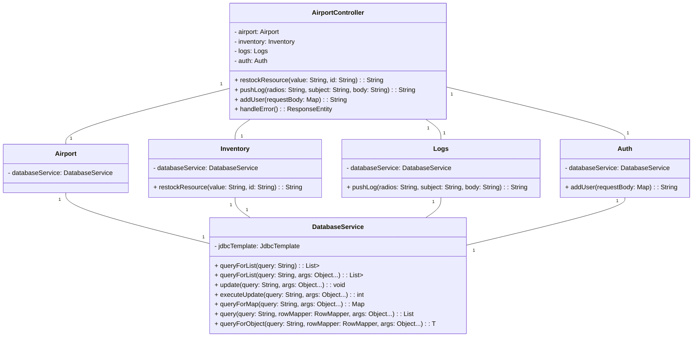

# Airport Staff Management System

This is a Java-based system that manages airport operations, including resource inventory, logging, and user authentication. The system is composed of several classes that work together to provide a comprehensive solution.

## Class Diagram

## Class Descriptions

### AirportController

The `AirportController` class is the main entry point for the system. It provides methods for managing resources, logging operations, adding users, and handling errors.

### Airport

The `Airport` class represents the airport itself and contains a reference to the `DatabaseService`.

### Inventory

The `Inventory` class manages the inventory of resources at the airport. It provides a method for restocking resources and uses the `DatabaseService` for data persistence.

### Logs

The `Logs` class handles logging operations at the airport. It provides a method for pushing log entries and uses the `DatabaseService` for data persistence.

### Auth

The `Auth` class is responsible for user authentication and authorization. It provides a method for adding new users and uses the `DatabaseService` for data persistence.

### DatabaseService

The `DatabaseService` class is a utility class that provides methods for interacting with a database using JDBC. It includes methods for executing queries, updates, and retrieving data in various formats.
